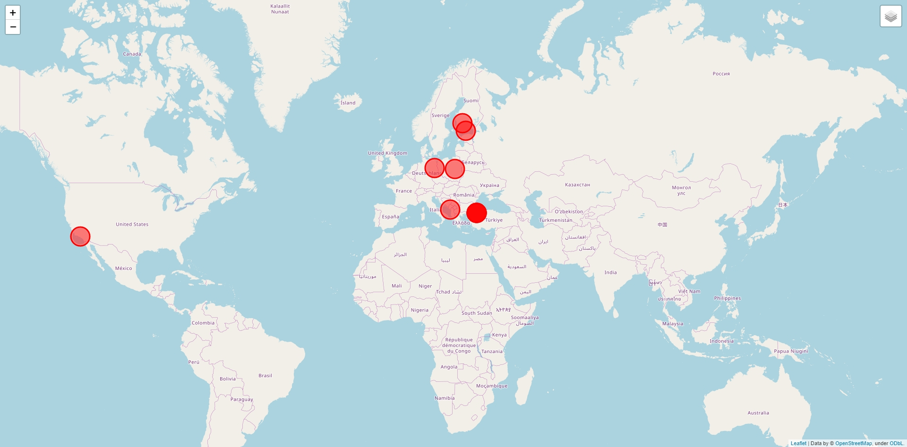

<b></b>
# Description
Module shows user the closest places where films were shot
# Note
For time constraints only 30000 films are used
# HTML
HTML contains the main map part and 2 layers with 10 circle markers
The first layers showcases the name of the film
The second layer showcases additional information, if it is present
# Image
Coords: 49.83826, 24.02324
Year: 2000

